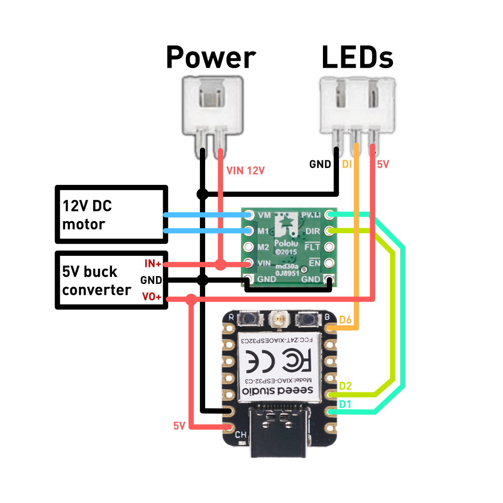

# 04-Moire_disc-DC_motor-fw

Firmware for the single-DC-motor version of the Moiré disc. One brushed DC
motor turns the disc through a Pololu MAX14870 driver, and a ring of 9
NeoPixels lights it from behind. You control everything from a smartphone. The
disc runs its own Wi-Fi network, and a web page served from it has the motor
and light controls.

It runs on a **Seeed XIAO ESP32-C3** or a **Seeed XIAO ESP32-C6**. Both use the
same source code and pins.

This is a rework of [04-Moire disc](https://github.com/KineticPrints/04-Moire_disc-controller_fw). That version drove two
stepper motors and took commands from a custom knob controller over ESP-NOW.

---

## Features

- **Wi-Fi access point + phone web page**: no app to install and no internet
  needed. The phone joins the `MoireDisc` network and the control page opens.
- **Motor control**
- **Light effects**
- **Settings are saved** in flash, 2 s after the last change. After a power
  cycle the disc starts with whatever was set last, so it runs on its own
  without a phone. The first boot uses slow motor speed and the Rainbow effect.
- **Several phones** can be connected at once. The page polls every 1.5 s, so
  every phone shows the same state.

---

## Hardware

| Part | Notes |
|---|---|
| Seeed XIAO ESP32-C3 **or** XIAO ESP32-C6 | Firmware builds for both |
| Pololu MAX14870 single brushed DC motor driver carrier | Sign-magnitude control through DIR + PWM, motor supply 4.5–36 V |
| Brushed DC (gear) motor | Drives the disc |
| 9 × WS2812B / NeoPixel LEDs | GRB, 800 kHz |
| Power supply | <!-- TODO: motor supply voltage, and how the 5 V rail is made --> |

### Pinout

| XIAO pin | C3 GPIO | C6 GPIO | Connects to |
|---|---|---|---|
| **D1** | GPIO3 | GPIO1 | MAX14870 **PWM** |
| **D2** | GPIO4 | GPIO2 | MAX14870 **DIR** |
| **D6** | GPIO21 | GPIO16 | LED ring **DIN** (through a series resistor) |
| 5V | – | – | LED ring 5 V (and XIAO supply) |
| 3V3 | – | – | – |
| GND | – | – | common ground: MAX14870 GND, LED GND, supply GND |

## Custom perfboard PCB layout

The electronics sit on a hand-wired perfboard, with the XIAO and the MAX14870
carrier plugged into female headers so either one can be swapped.

  LED flickers, add a level shifter (e.g. 74AHCT125) or run the first LED from
  a slightly lower voltage.
